# **AdHub**

### The AdHub portal helps users find the necessary goods and services. All ads are categorized. Authorized users can create and edit their ads. 

Adhub allows registered users to create ads and a profile with their phone, email and photo. The ad's author can add a title, description, price, condition, and location. Also, the author can attach up to 5 photos to the ad.  

# **[Link to Live Site](https://ad-hub-c8e895f9e3aa.herokuapp.com/)**  

**Built by Anton Byshok**

---

# Table of Contents  

1. [UX](#ux)
   - [Overview](#overview)
   - [Database Planning](#entity-relationship-model)
   - [Wireframes](#wireframes)
2. [Agile Development](#agile-development)
   - [Kanban Board](#kanban-board)
   - [User Stories](#user-stories)
3. [Features](#features-implemented)  
4. [Technology Used](#technology-used) 
5. [Testing](#testing-and-validation)   
6. [Deployment](#deployment)
7. [Resources](#resources)  
8. [Credits and Acknowledgements](#credits-and-acknowledgements)

---

# **UX**

## **Overview**
Adhub is an ads portal which helps people to find something and buy. It also helps people to sell their goods or services.

## Entity Relationship Model

I used draw.io to create my database entity relationship diagrams. Below you can see how each model relates to eachother.  
I used a custom model for the User to add an avatar.

### Relationships

## Wireframes

### Home Page

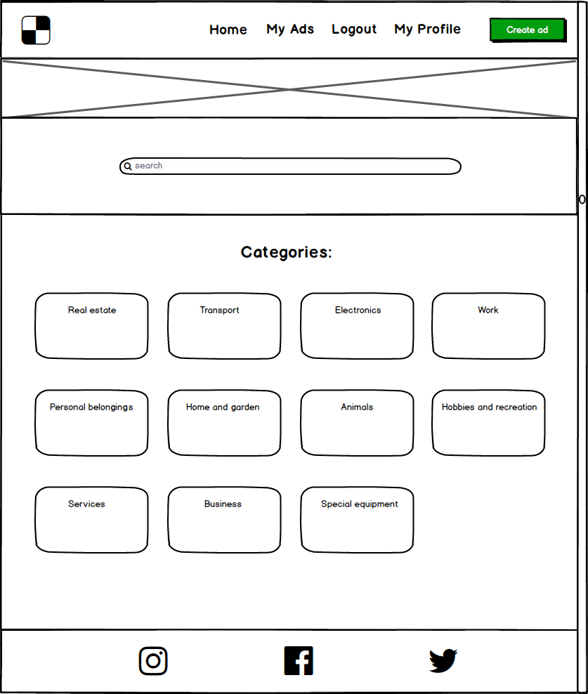

---

### Category Page

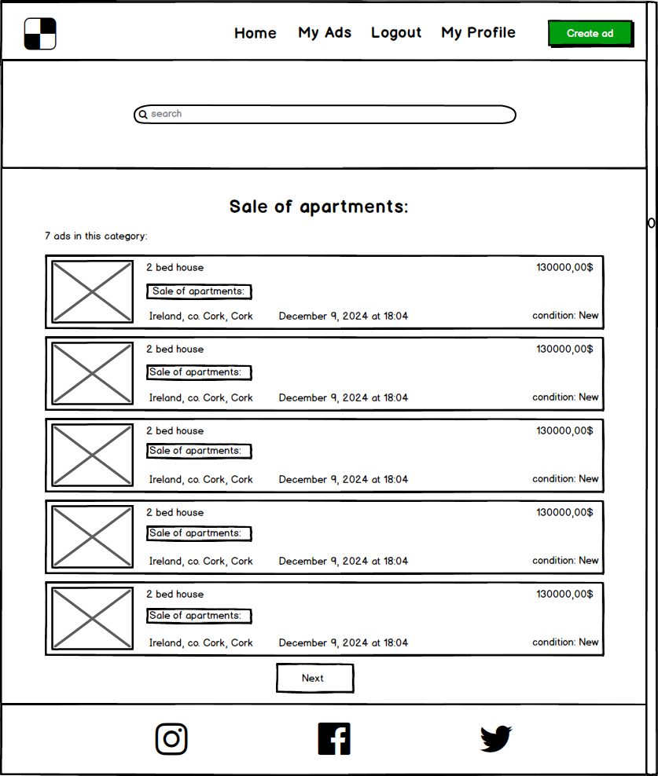

---

### Ad Page

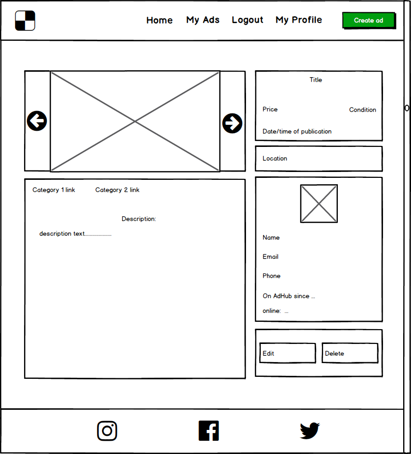

---

### My / User Ads Page

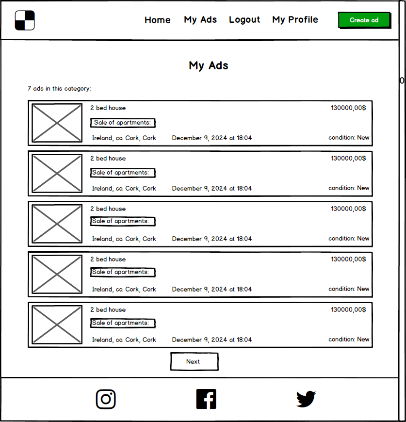

---

### Create / Edit Ad Form

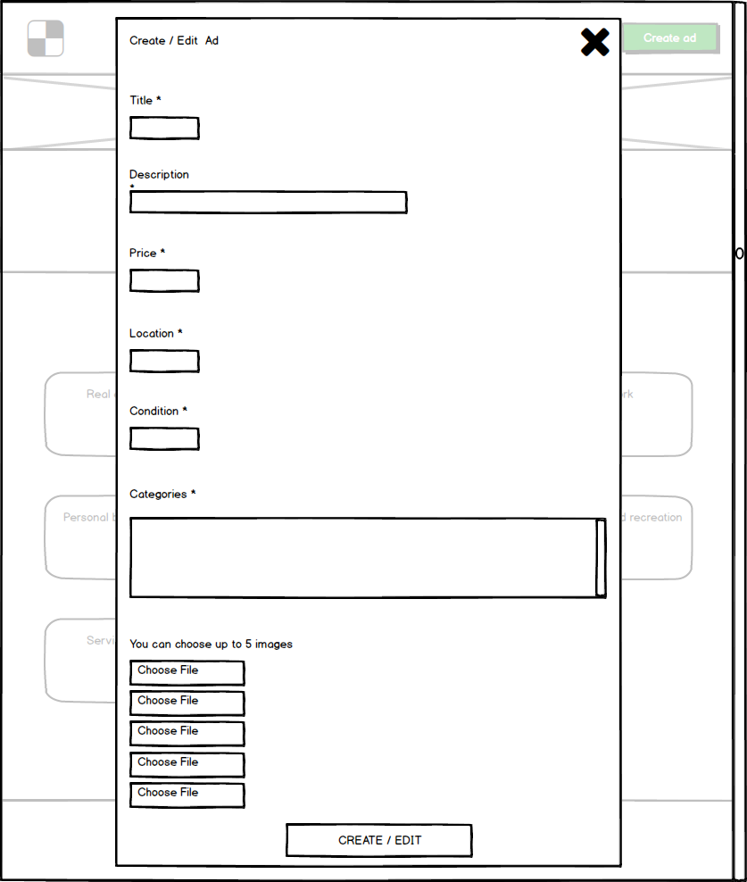

---

### Search results Page

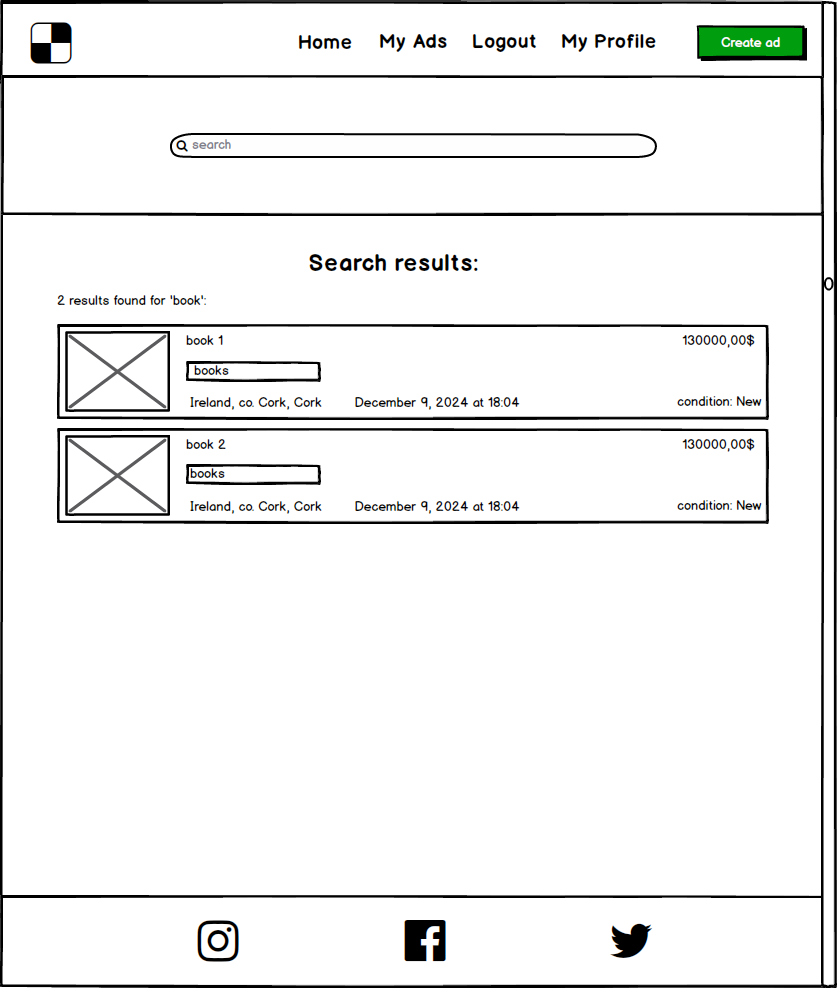

---

# **Agile**

## **Kanban Project Board**

The board included:
- **Todo (backlog)**: backlog.
- **In Progress**:    Tasks actively being worked on.
- **Done**:           Completed tasks.

**[Link to Kanban Project Board](https://github.com/users/webmag-anton/projects/5)**

## **User Stories**
### User Story 1: User Authentication
As a **user**, I can **register and log to the site** so that **my profile is securely accessible only to me.**

#### Acceptance Criteria
- Users must be able to register with an email and password.
- Logged-in users can access their personal account.
- Invalid login attempts display error messages.

---

### User Story 2: Create and Manage Spaces
As a **user**, I want **a simple and intuitive design** so that **I can easily navigate and feel comfortable when using it.**

#### Acceptance Criteria
- The website has a clean, uncluttered layout with intuitive menus and clear navigation links.
- Buttons and interactive elements are large enough to be easily clicked on mobile devices.
- The layout maintains visual consistency across all pages, with clear headings and logical flow.
- The footer has media links and copyright text

---

### User Story 3: Home Page
As a **user**, I want **to visit a home page that displays search bar and ads categories** so that **I can find ads.**

#### Acceptance Criteria
- The user can visit the home page
- The user can see search bar
- The purpose of the site is apparent to the user
- The user can see the section with ads categories with links to each subcategory

---

### User Story 4: Navbar
As a **user**, I want to **see a navbar that displays links for login, registration, my ads, my profile and the 'Create Ad' button** so that **I can navigate through the site and create ads.**

#### Acceptance Criteria
- The user can see the navbar with all links
- The user can open the form in a popup by clicking the 'Create Ad' button
- The user can see site logo

---

### User Story 5: Create Ad Form
As a **user**, I want to **open Create Ad Form** so that **I can create my add in popup.**

#### Acceptance Criteria
- I can click green button (Create Ad) from navbar and open form
- I can add title (required), description (required), price (required), location (required), condition (required)
- I can choose category for my new ad
- I can attach up to 5 images to my ad

---

### User Story 6: Register, Log in/out and My Profile pages
As a **user**, I want to **register, log in/out and edit my profile page** so that **I can create own ads.**

#### Acceptance Criteria
- I can register on the register page adding my Username, Email (optional), Avatar (optional) and Password
- I can log in on the log in page with my Username and Password
- I can log out on the log out page with confirmation
- I can edit my profile on the My Profile page

---

### User Story 7: My ads page
As a **user**, I want to **have My ads page** so that **I can see list with my ads and total amount of them.**

#### Acceptance Criteria
- I can open My ads page and browse list with my ads
- I can total amount of my ads
- each items in this list should be a link to add

---

### User Story 8: Ad page
As a **user**, I want to **have a page for each ad I see on the site** so that **I can read information and connect with the ad's author.**

#### Acceptance Criteria
- The user can see the ad's images inside the carousel
- The user can read all the ad's information: title, description, price, location, condition, categories, creation time
- The user can read all information about the author and click the link leading to the author's ads

---

### User Story 9: Ad page
As a **As a logged-in user**, I want to **edit/remove my ads** so that **I can update my ads and remove deprecated ones.**

#### Acceptance Criteria
- I can edit my ad inside the popup form by clicking the appropriate button on the ad's page
- I can remove my ad by clicking the appropriate button (with confirmation) on the ad's page

---

### User Story 10: Search page
As a **user**, I want to **have a search page** so that **I can see all found ads with the total amount of them.**

#### Acceptance Criteria
- The user can see a list of all found ads by clicking the search button
- The user can open each ad

---

### User Story 11: Category page
As a **user**, I want to **have a page for each category** so that **I can see all found ads by category with the total amount of them.**

#### Acceptance Criteria
- The user can see a list of all the ads associated with the chosen category and the total amount of found ads
- Ads can have some categories

---

### User Story 12: Pagination
As a **user**, I want to **have pagination for My ads page, Category page, and Author's ads page** so that **I can read ads lists more easily.**

#### Acceptance Criteria
- The user can see pagination with the Prev and Next buttons
- Each page should have 5 ads

---

### User Story 13: Notifications
As a **user**, I want to **have notification after registration (also after log in/out) on site, creating/editing/deleting ads** so that **I can be sure that I've made some action.**

#### Acceptance Criteria
- The user sees all notifications in the bottom right corner

---

# **Features and Responsiveness**

## Home Page:

- Displays a list of ads' categories.
- Provides search bar for ads.
- Displays navbar with Create Ad button.
- Includes a responsive design to ensure usability on various screen sizes.

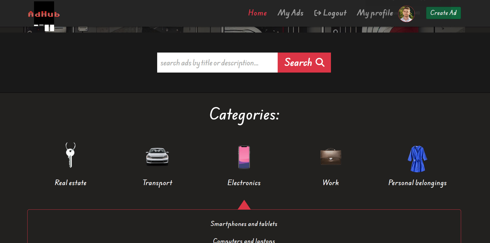
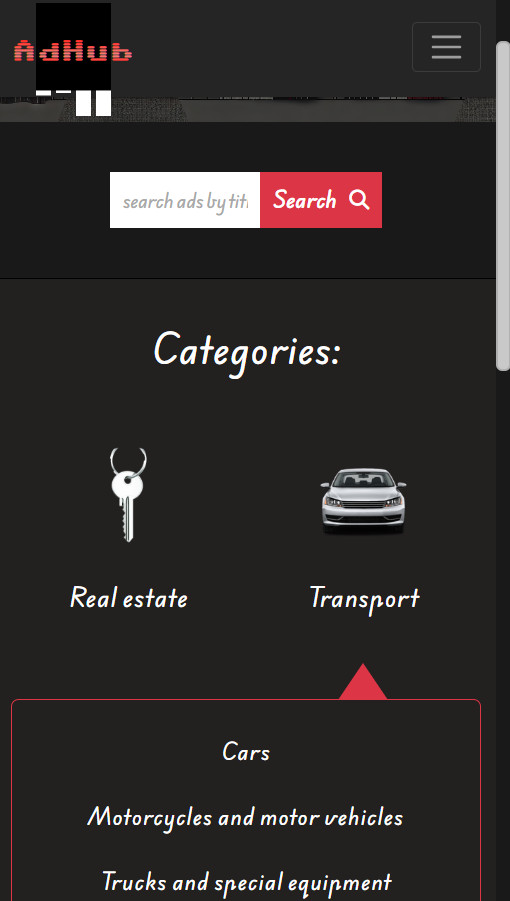

## Create Form:

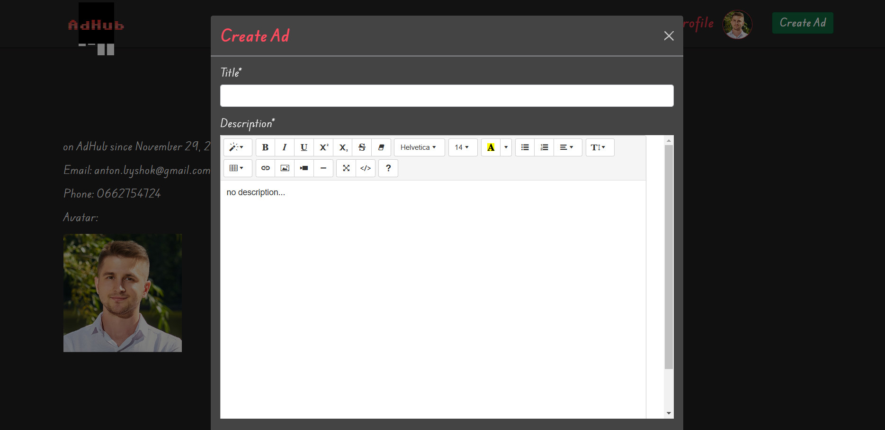
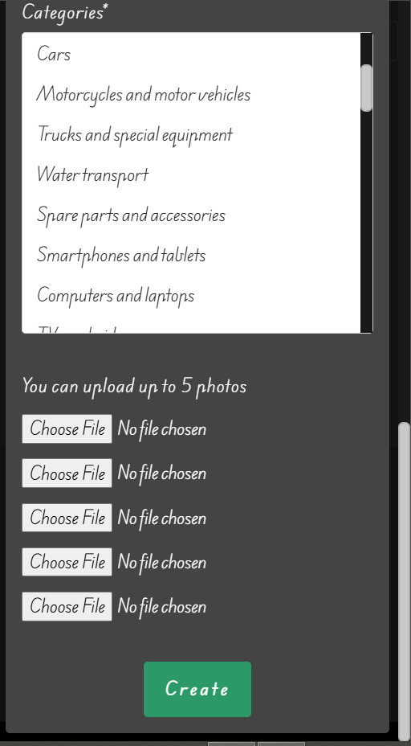

## Ad Page:

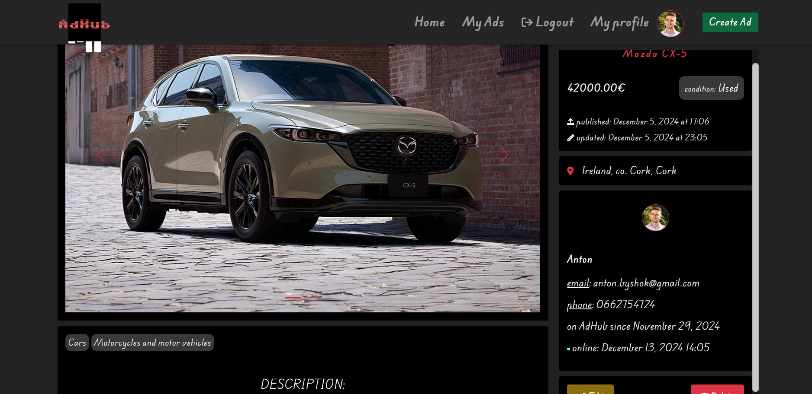
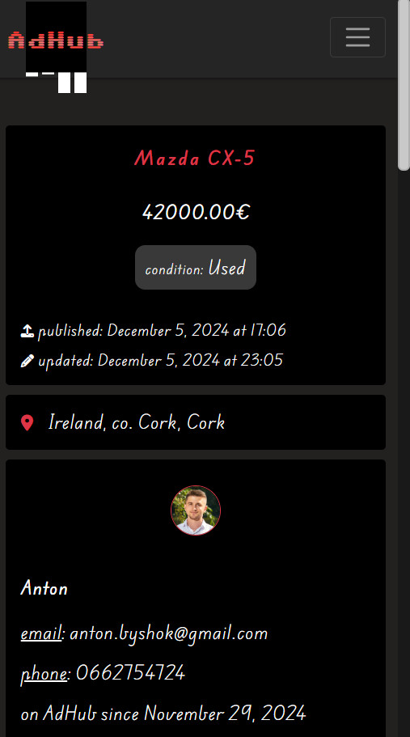

## My Ads Page:

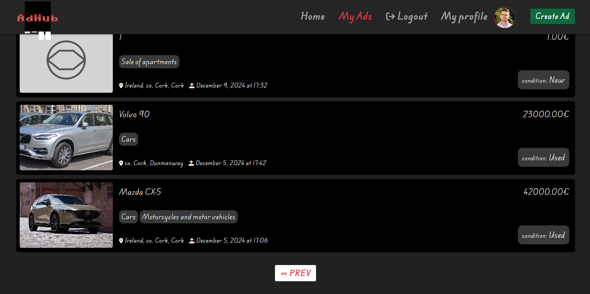
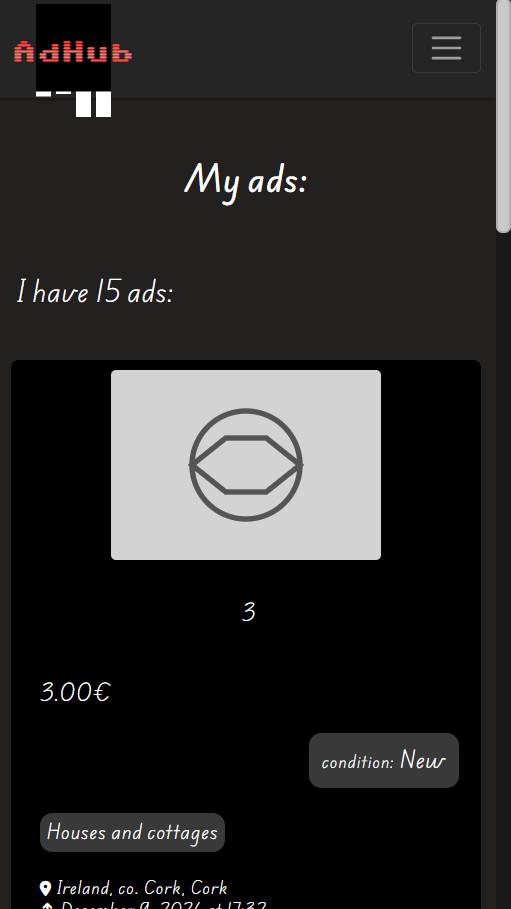

## My Profile Page:

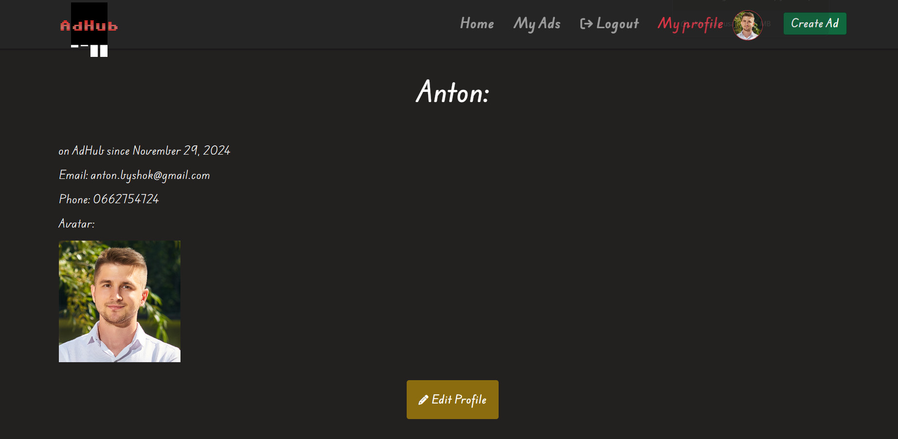
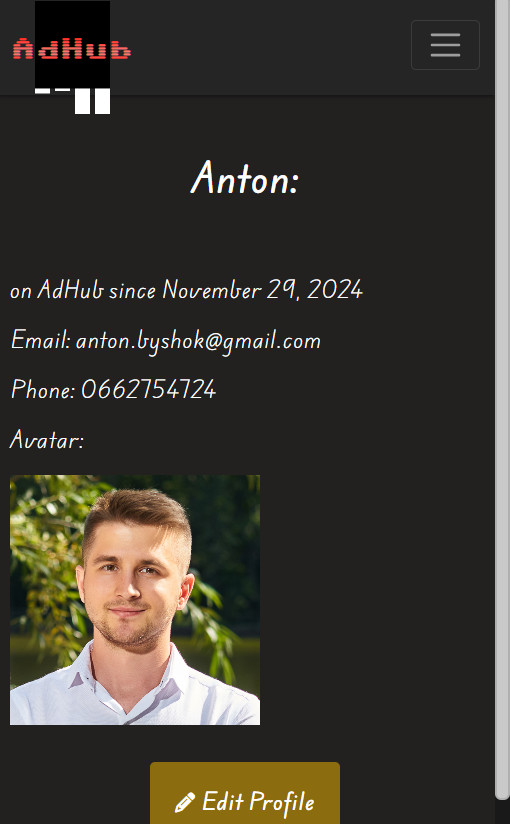

---

## **Technology Used**

- **Frontend**: HTML5, CSS3, JavaScript, Bootstrap
- **Backend**: Django (Python)
- **Database**: PostgreSQL
- **Hosting**: Heroku, Cloudinary
- **Version Control**: Git / GitHub
- **Wireframes**: Balsamiq

---

## **Testing and Validation**

## **Responsiveness**
Adhub was tested across multiple devices in different browsers.

## Additional Security checks:
- Prevents users from accessing or modifying data they do not own.
- Redirects unauthorized users attempting restricted actions to the login page.
- Restricts access to expense spaces and features for unauthorized users.
- Validates form inputs to prevent malicious submissions.

### Manual Testing Results

#### Features Tested:
- Authentication: successful registration, login, and logout flows.
- Ads: adding, editing, and deleting ads for logged-in users.
- Search: users can search ads by the ad's title or descriptions.
- Responsive Design: tested on different browsers on some devices.

#### HOME PAGE

| Test Description                                             | Result |
|--------------------------------------------------------------|--------|
| Ensure the home page loads correctly without errors          | Pass   |
| Verify that unauthenticated users see the correct UI         | Pass   |
| Confirm that users can browse categories and use search bar  | Pass   |
| Confirm that the purpose of the site is apparent to the user | Pass   |

#### My Ads PAGE

| Test Description                                             | Result |
|--------------------------------------------------------------|--------|
| Ensure that user can browse list with own ads                | Pass   |
| Ensure that user can see total amount of ownads              | Pass   |
| Ensure that each items in this list should be a link to ad   | Pass   |
| Confirm unauthorized access redirects to the login page      | Pass   |

#### My Profile PAGE

| Test Description                                             | Result |
|--------------------------------------------------------------|--------|
| Ensure that user can edit/delete own profile data            | Pass   |
| Ensure that user can see and change own avatar               | Pass   |

#### Create / Edit Ad Form and Ad's deletion

| Test Description                                                 | Result |
|------------------------------------------------------------------|--------|
| Ensure that loged-in user can create ad inside the popup form    | Pass   |
| Ensure that loged-in user can edit own ad inside the popup form  | Pass   |
| Ensure that loged-in user can remove own ad (with confirmation)  | Pass   |

#### Ad PAGE

| Test Description                                                 | Result |
|------------------------------------------------------------------|--------|
| Ensure that user can see the ad's images inside the carousel     | Pass   |
| Ensure that user can read title, description, price, location    | Pass   |
| Ensure that user can read condition, categories, creation time   | Pass   |
| Ensure that user can read all information about the author       | Pass   |

#### Search Results PAGE

| Test Description                                                 | Result |
|------------------------------------------------------------------|--------|
| Ensure that user can see a list of all found ads                 | Pass   |
| Ensure that user can open each ad                                | Pass   |
| Ensure that page has pagination                                  | Pass   |

#### Category PAGE

| Test Description                                                 | Result |
|------------------------------------------------------------------|--------|
| Ensure that user see a list of all the ads by category           | Pass   |
| Ensure that user see the total amount of found ads               | Pass   |
| Ensure that ads can have some categories                         | Pass   |

#### Register/Login/Logout PAGES

| Test Description                                                 | Result |
|------------------------------------------------------------------|--------|
| Ensure that user can register by clicking Register button        | Pass   |
| Ensure that user can login by clicking Login button              | Pass   |
| Ensure that ads can logout by clicking Logout button             | Pass   |

---
- I used the [W3 HTML Validator](https://validator.w3.org/#validate_by_input+with_options) to check the HTML on each of my site pages by Direct Input. There are validation errors associated with the use of the Summernote widget that cannot be corrected because they are located inside an iframe and were made by the widget authors.

- I used the [W3 CSS Validator](https://jigsaw.w3.org/css-validator/#validate_by_input) to check my CSS by Direct Input. I found no errors.

- I used the [JavaScript Validator](https://www.site24x7.com/tools/javascript-validator.html) to validate my JavaScript code, which passed without issue.

- I used the [CI Python Linter](https://pep8ci.herokuapp.com/) to check all python scripts for models, views and forms. I found no errors.

---

## Deployment Steps:

#### Creating the Heroku App

- Begin by signing up or logging in to Heroku.
- In the Heroku Dashboard, click on 'New' and then select 'Create New App'.
- Choose a unique name for your project.
- Select the EU region.
- Click on "Create App".
- In the "Deploy" tab, choose GitHub as the deployment method.
- Connect your GitHub account and find/connect your GitHub repository.

#### Setting Up Environment Variables

- Create `env.py` in the top level of the Django app.
- Import `os` in `env.py`.
- Set up necessary environment variables in `env.py`, including the secret key and database URL.
- Update `settings.py` to use environment variables for secret key and database.
- Configure environment variables in the Heroku "Settings" tab under "Config Vars".
- Migrate the models to the new database connection in the terminal.
- Configure static files and templates directories in `settings.py`.
- Add Heroku to the `ALLOWED_HOSTS` list.

#### Creating Procfile and Pushing Changes

- Create a `Procfile` in the top level directory.
- Add the command to run the project in the `Procfile`.
- Add, commit, and push the changes to GitHub.

#### Heroku Deployment

- In Heroku, navigate to the Deployment tab and deploy the branch manually.
- Monitor the build logs for any errors.
- Upon successful deployment, Heroku will display a link to the live site.
- Make sure to resolve any deployment errors by adjusting the code as necessary.

### Forking the Repository

Forking the GitHub Repository allows you to create a copy of the original repository without affecting it. 

### Creating a Clone of the Repository

Creating a clone enables you to make a local copy of the repository. Follow these steps:

- Navigate to the [Adhub](https://github.com/webmag-anton/ad_hub) repository.
- Use `git clone`.

---

## **Credits and Acknowledgements**

### Facilitators and Support
- **David Calikes** - Facilitator. His guidance and support were essential throughout the project.
- **John Rearden** - Program Coding Coach. Assisted with technical issues, ensuring a smooth workflow. 

---